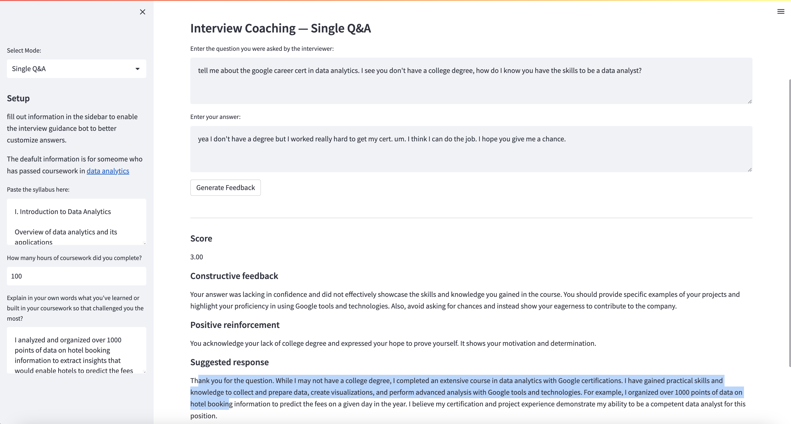

# interview-coach-ai

This app shows how ChatGPT can be used to generate helpful feedback and coaching for people taking job interviews.

This application will analyze a question asked by the hiring manager, the response given by the candidate, and information about what coursework and challenges the candidate has solved to provide feedback and a suggested response. 

I wrote this app to help [MeritAmerica](https://meritamerica.org/), a non-profit that helps re-train adults in tech careers. I was told that often the first time the learners in MeritAmerica's program have ever used zoom is in the training. It's not a surprise then that people who have passed coursework will be unconfident in their skills, nervous, and struggle to market their skills accordingly in a job interview. 

The default question and answer were provided to me by MeritAmerica as a typical example. The app does a pretty good job at recommending a better answer! 



The next step would be to review actual interviews from the candidate and automatically review and create response suggestions.

## 🚀 Features

* Two modes: Page 1 — Single question and answer feedback. Page 2 — feedback on an entire interview transcript
* Runs OpenAI API calls async
* Provides a score from 1-10 on the candidates response
* Provides constructive feedback 
* Provides reinforcement to the candidate: which things did they do well that they should continue doing?
* Provides a suggested response

## 💾 Installation

To install Interview Coach AI, follow these steps:

1. Clone the repository:
For this step you need Git installed, but you can just download the zip file instead by clicking the button at the top of this page ☝️
```
git clone https://github.com/wjessup/interview-coach-ai.git
```

2. Install the required dependencies:
```
pip install -r requirements.txt
```

3. Open `main.py` and set your API key here: `openai.api_key = yourapikey`
  - Obtain your OpenAI API key from: https://platform.openai.com/account/api-keys.

## 🔧 Usage

1. Run the `main.py` Python script via Streamlit in your terminal:
```
streamlit run main.py
```
